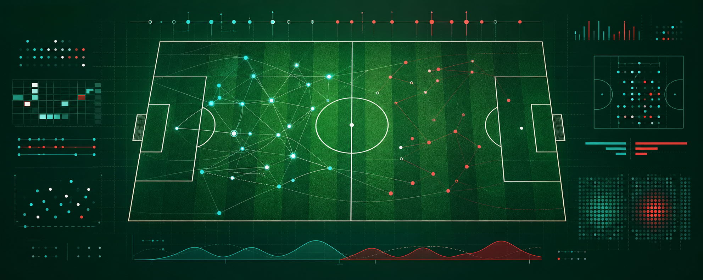
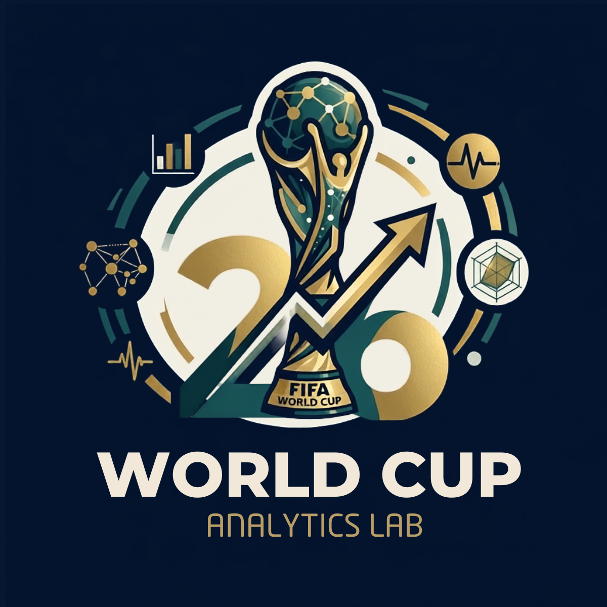

# World Cup 2026 Dataset

## All 104 FIFA Training Centre post-match reports, organized into 95,739 rows and 1.47M+ structured data cells across match, team, and player performance.



<p align="center">
  <a href="https://worldcup26-analyticslab.vercel.app/">
    
  </a>
  &nbsp;&nbsp;&nbsp;
  
</p>

Open CSV dataset for exploring FIFA World Cup 2026 match, team, and player-level performance data.

[](data/csv)
[](data/csv/matches.csv)
[](data/csv/teams.csv)
[](docs/table_inventory.md)
[](metadata/dataset_summary.json)
[](LICENSE)
[](https://worldcup26-analyticslab.vercel.app/)

The tables in this repository are based on publicly available post-match reports from the FIFA Training Centre. They are organized for analysts, journalists, students, scouts, builders, and football fans who want to explore the tournament through structured data.

This repository publishes data tables only. It does not include report PDFs, player images, scraped media, or dashboard assets.

## Dataset At A Glance

| Coverage | Count |
| --- | ---: |
| Matches | 104 |
| Teams | 48 |
| Player records | 1,277 |
| Published CSV tables | 21 |
| Published rows | 95,739 |
| Structured data cells | 1,476,650 |
| Team-match rows | 208 |
| Match appearance rows | 5,392 |
| Passing-network edges | 52,072 |

## Quick Links

| Destination | Use it for |
| --- | --- |
| [Analytics Lab](https://worldcup26-analyticslab.vercel.app/) | Explore the tournament visually and uncover match, team, and player insights. |
| [Table Inventory](docs/table_inventory.md) | See every published table with row and column counts. |
| [Data Dictionary](docs/data_dictionary.md) | Inspect the columns available in each CSV. |
| [Schema Guide](docs/schema.md) | Understand join keys and relationships. |
| [CSV Data](data/csv) | Download or query the published tables directly. |

## What's Included

- 104 matches
- 48 teams
- 1,277 player records
- 21 published CSV tables
- Match metadata, scores, venues, groups, and source links
- Lineups, starters, substitutes, cards, goals, and appearance records
- Attempts at goal and event timelines
- Passing-network edges
- Player in-possession, out-of-possession, line-break, reception, crossing, and physical data
- Team key stats, phases, set plays, pressure, aerial control, goal prevention, and goalkeeping distribution

## Repository Layout

```text
assets/                   Repository banner and brand assets
data/csv/                 Published CSV tables
docs/data_dictionary.md   Table-by-table columns and row counts
docs/schema.md            Join keys and table relationships
docs/sources.md           Source and attribution notes
docs/table_inventory.md   Compact table inventory
metadata/schema.json      Machine-readable table columns
metadata/dataset_summary.json
metadata/table_manifest.csv
```

## Start Here

The core tables are:

- `data/csv/matches.csv`
- `data/csv/teams.csv`
- `data/csv/players.csv`
- `data/csv/match_teams.csv`
- `data/csv/match_appearances.csv`

Most player-level fact tables join through `appearance_id`. Most team-level fact tables join through `match_team_id`.

Example DuckDB query:

```sql
SELECT
  m.match_number,
  m.home_team,
  m.away_team,
  a.team,
  a.player_name,
  a.minute,
  a.outcome,
  a.body_part
FROM read_csv_auto('data/csv/attempts_at_goal.csv') a
JOIN read_csv_auto('data/csv/matches.csv') m
  ON a.match_id = m.match_id
ORDER BY m.match_number, a.minute;
```

## Related Project

Explore the companion platform at [World Cup 26 Analytics Lab](https://worldcup26-analyticslab.vercel.app/).

The Analytics Lab is a public platform for exploring the tournament, uncovering the dataset, and turning the FIFA Training Centre reports into a deeper football analysis experience. It helps you move from match-level context into team patterns, individual player profiles, comparisons, passing networks, tactical matchups, and scouting-style insights.

Use this repository when you want the raw tables. Use the Analytics Lab when you want to investigate the tournament visually, dig into matches and teams, and uncover the stories behind the data.

## Notes

- Data is provided as CSV for easy use in spreadsheets, BI tools, DuckDB, R, SQL engines, and notebooks.
- Source report links are available in `matches.csv` under `source_url`.
- This project is not affiliated with FIFA.
- Please cite the source reports and this repository when using the data.
